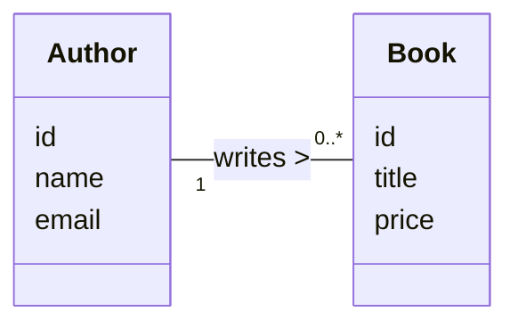
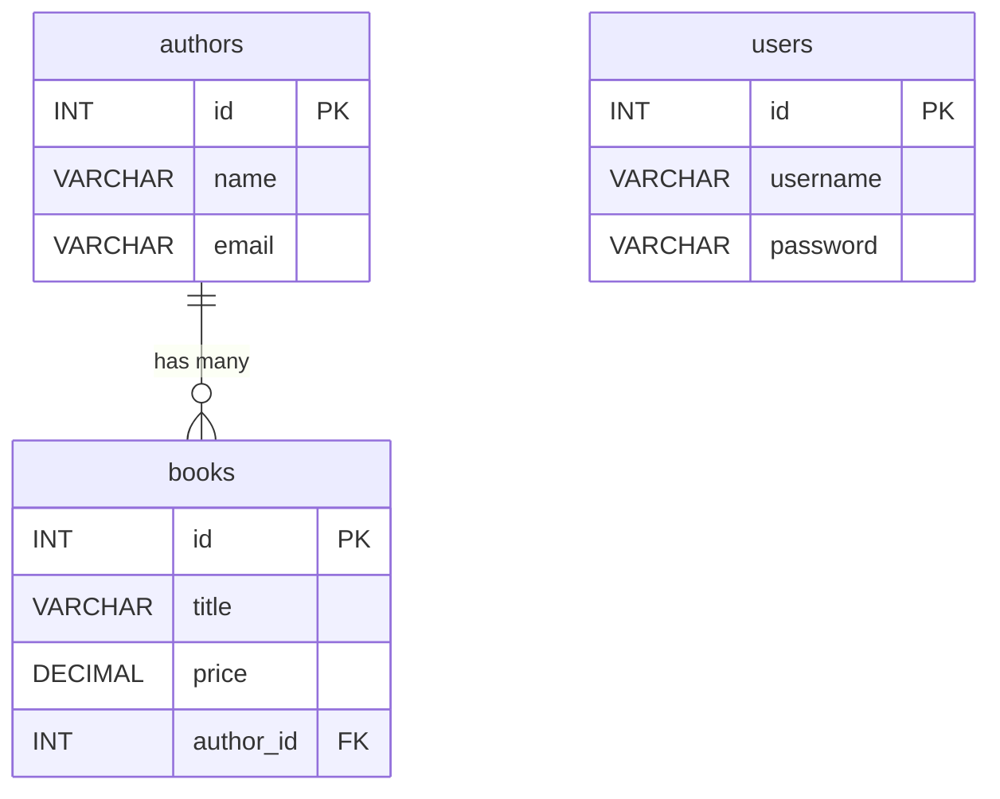

# Desain Basis Data (CDM & PDM)

Berikut adalah rancangan **Conceptual Data Model (CDM)** dan **Physical Data Model (PDM)** untuk proyek Perpustakaan ini. Meskipun saat ini aplikasi menggunakan penyimpanan *in-memory* (Java List), desain ini menggambarkan bagaimana struktur data tersebut jika diimplementasikan dalam database relasional (seperti MySQL).

## 1. Conceptual Data Model (CDM)
CDM menggambarkan struktur logis entitas dan hubungan antar entitas tanpa mempedulikan tipe data fisik.

### Entitas
1.  **Author (Penulis)**
    *   Menyimpan informasi tentang penulis buku.
    *   Atribut: Nama, Email.
2.  **Book (Buku)**
    *   Menyimpan informasi tentang buku.
    *   Atribut: Judul, Harga.

### Hubungan (Relationship)
*   **One-to-Many (1:N)**: Satu **Author** dapat menulis banyak **Book**. Satu **Book** hanya ditulis oleh satu **Author** (dalam konteks penyederhanaan ini).

### Diagram CDM


---

## 2. Physical Data Model (PDM)
PDM adalah representasi detail yang siap diimplementasikan ke dalam database, lengkap dengan tipe data, Primary Key (PK), dan Foreign Key (FK).

### Struktur Tabel

#### Tabel: `authors`
| Nama Kolom | Tipe Data (SQL) | Constraint | Deskripsi |
| :--- | :--- | :--- | :--- |
| `id` | `INT` | **PK**, Auto Increment | ID unik untuk setiap penulis |
| `name` | `VARCHAR(100)` | Not Null | Nama lengkap penulis |
| `email` | `VARCHAR(100)` | Unique | Alamat email penulis |

#### Tabel: `books`
| Nama Kolom | Tipe Data (SQL) | Constraint | Deskripsi |
| :--- | :--- | :--- | :--- |
| `id` | `INT` | **PK**, Auto Increment | ID unik untuk setiap buku |
| `title` | `VARCHAR(255)` | Not Null | Judul buku |
| `price` | `DECIMAL(10, 2)`| Not Null | Harga buku |
| `author_id`| `INT` | **FK** | Menghubungkan ke tabel `authors.id` |

#### Tabel: `users`
| Nama Kolom | Tipe Data (SQL) | Constraint | Deskripsi |
| :--- | :--- | :--- | :--- |
| `id` | `INT` | **PK**, Auto Increment | ID unik untuk setiap pengguna |
| `username` | `VARCHAR(50)` | Not Null, Unique | Nama pengguna |
| `password` | `VARCHAR(255)` | Not Null | Kata sandi |

### Diagram PDM (ERD)


### Implementasi SQL (Contoh)
Jika Anda ingin mengubah `DataStore` in-memory menjadi database MySQL di masa depan, berikut adalah query SQL untuk membuatnya:

```sql
CREATE DATABASE library_db;
USE library_db;

CREATE TABLE authors (
    id INT AUTO_INCREMENT PRIMARY KEY,
    name VARCHAR(100) NOT NULL,
    email VARCHAR(100)
);

CREATE TABLE books (
    id INT AUTO_INCREMENT PRIMARY KEY,
    title VARCHAR(255) NOT NULL,
    price DECIMAL(10, 2) NOT NULL,
    author_id INT,
    FOREIGN KEY (author_id) REFERENCES authors(id) ON DELETE CASCADE
);

CREATE TABLE users (
    id INT AUTO_INCREMENT PRIMARY KEY,
    username VARCHAR(50) NOT NULL UNIQUE,
    password VARCHAR(255) NOT NULL
);

-- Insert default user (admin/admin)
INSERT INTO users (username, password) VALUES ('admin', 'admin');
```
